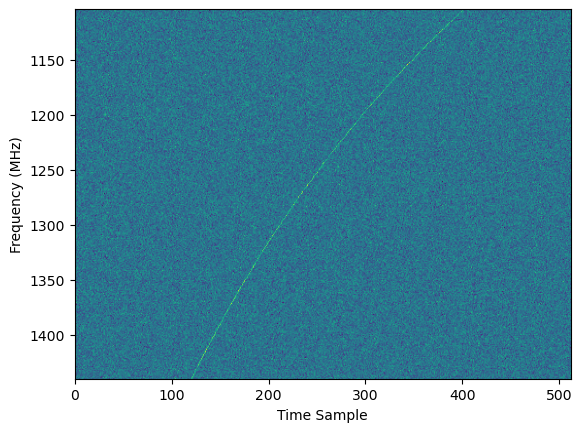
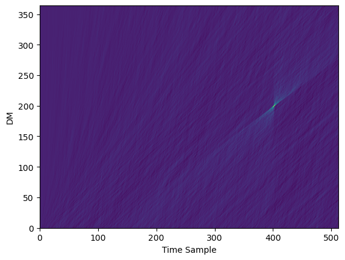

# dmt

[](https://github.com/pravirkr/dmt/actions/workflows/ci.yml)
[](https://codecov.io/gh/pravirkr/dmt)


[](https://github.com/pravirkr/dmt/blob/main/LICENSE)

## Dispersion Measure Transforms

|           |           |
| --------- | --------- |
|  |  |

## Requirements

- Python **3.12+**
- C++20 compiler (GCC **13+** or Clang **18+**)
- [FFTW](http://www.fftw.org/) and OpenMP development libraries
- Optional: CUDA **12.6+** for GPU builds (`DMT_CUDA=AUTO` or `ON`)

## Installation

Recommended: [uv](https://docs.astral.sh/uv/) (matches CI and local development).

```bash
git clone https://github.com/pravirkr/dmt.git
cd dmt
uv sync
```

The extension is built via [scikit-build-core](https://scikit-build-core.readthedocs.io/) and installed into the project virtual environment. To pass CMake options (for example CPU-only):

```bash
CMAKE_ARGS="-DDMT_CUDA=OFF" uv sync
```

You can also install from Git with pip:

```bash
uv pip install -U git+https://github.com/pravirkr/dmt
```

## Running tests / coverage

C++ tests use Catch2. GPU cases are compiled only when CUDA is enabled; they are tagged `[gpu]` / `[parity]` and skip at runtime if no device is present. GitHub CI is CPU-only (`DMT_CUDA=OFF` and `ctest -LE gpu`).

### Python (recommended)

```bash
uv sync --extra tests
uv run pytest tests/python
```

### C++ (CMake)

Using cmake command:

```bash
cmake -B build -G Ninja \
  -DDMT_BUILD_TESTING=ON \
  -DDMT_BUILD_PYTHON=ON \
  -DDMT_CUDA=OFF \
  -DDMT_ENABLE_NATIVE_ARCH=OFF \
  -Dpybind11_DIR=$(python -c 'import pybind11; print(pybind11.get_cmake_dir())')
cmake --build build -j
ctest --test-dir build/tests/cpp -LE gpu --output-on-failure
```

GPU Catch2 cases on a machine with CUDA:

```bash
./build/tests/cpp/dmt_tests '[gpu]'
```

### Coverage

Locally:

```bash
# C++ (gcov, gcc)
cmake -B build -DDMT_ENABLE_COVERAGE=ON -DDMT_BUILD_TESTING=ON -DDMT_BUILD_PYTHON=OFF -DDMT_CUDA=OFF
cmake --build build -j
ctest --test-dir build/tests/cpp -LE gpu
gcovr --cobertura coverage.xml

# Python
uv run pytest --cov=dmtlib --cov-report=xml tests/python
```

## Usage

### Incoherent FDMT

```python
import numpy as np
from dmtlib import FDMTCPU

frb = np.ones((nchans, nsamps), dtype=np.float32)
thefdmt = FDMTCPU(f_min, f_max, nchans, nsamps, tsamp, dt_max=dt_max, dt_min=0, dt_step=1)  # mode="valid" by default
dmt_transform = thefdmt.execute(frb.astype(np.float32))
```

### Coherent Fast Dispersion Measure Transform (CFDMT)

CFDMT implements the Zackay et al. hybrid dispersion transform combining coherent dedispersion over sparse coarse DM trials with a fine-resolution FDMT tree:

1. **Coherent Dedispersion**: Baseband voltage streams (dual polarization) are transformed via forward FFT and multiplied by high-precision (double) chirp phases for each coarse DM trial.
2. **Channelization & Detection**: Backward FFT synthesizes channels, and polarizations are detected to total intensity (Stokes $I = |P_1|^2 + |P_2|^2$).
3. **Inter-channel Delays & Fine FDMT**: Bulk geometric delays between subbands are applied, and an internal fine FDMT tree symmetrically covers $[-\Delta\text{DM}/2, +\Delta\text{DM}/2]$ around each coarse trial.
4. **Unified Output & Variance Normalization**: Returns a 2D dispersion space `(ndm_total, nsamps)` with built-in per-DM variance and sigma profiles for exact S/N calibration.

```python
import numpy as np
from dmtlib import CohFDMTPlan, CohFDMTCPU  # or CohFDMTCUDA for GPU

# Configure hybrid search plan
plan = CohFDMTPlan(
    f_center=1250.0,    # Center frequency (MHz)
    bw_sub=25.0,        # Subband bandwidth (MHz)
    nsub=4,             # Number of subbands
    tbin=1.0e-6,        # Raw voltage sampling interval (s)
    nbin=1024,          # Raw voltage samples per FFT block
    nfft=2,             # Blocks per coherent segment
    t_p=4.0e-6,         # Detected time resolution (s)
    dm_max=50.0,        # Maximum DM trial (pc/cm^3)
    dm_min=0.0,         # Minimum DM trial (pc/cm^3)
    noverlap=32,        # Overlap samples for convolution
)

# Initialize engine (allocates internal buffers, FFT plans, and fine FDMT)
coh_fdmt = CohFDMTCPU(
    plan.f_center, plan.bw_sub, plan.nsub, plan.tbin,
    plan.nbin, plan.nfft, plan.t_p, plan.dm_max, plan.dm_min, plan.noverlap,
)

# Execute on raw packed baseband voltage (uint8: 2 pol x 2 (real/imag))
# Returns 2D float32 array of shape (plan.ndm, plan.dmt_nsamps)
dmt_grid = coh_fdmt.execute(baseband_u8)

# Obtain variance and sigma calibration grids for SNR evaluation
var_grid = plan.get_effective_variance_grid()  # (plan.ndm,)
sig_grid = plan.get_effective_sigma_grid()      # (plan.ndm,)
snr_grid = dmt_grid / sig_grid[:, None]
```

## Benchmarks

```python
f_min = 704.0, f_max = 1216.0, nchans = 4096, tsamp = 0.00008192, dt_max = 2048, nsamps = n;
nthreads = 1, 8;
```


