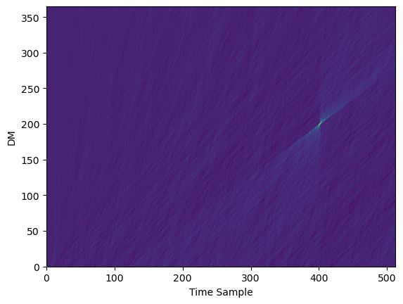
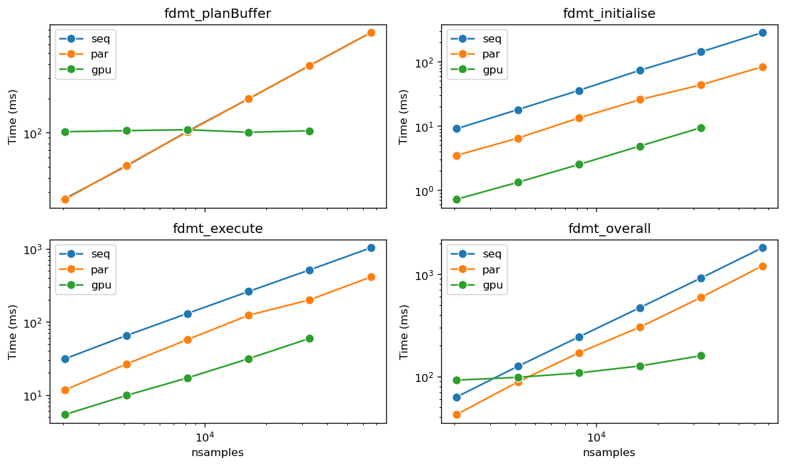

<p align="center">
  <picture>
    <source media="(prefers-color-scheme: dark)" srcset="docs/_static/logo/dmt-logo-tagline-dark.svg">
    
  </picture>
</p>

<div align="center">

[](https://dmt.readthedocs.io/en/latest/?badge=latest)
[](https://github.com/pravirkr/dmt/actions/workflows/ci.yml)
[](https://codecov.io/gh/pravirkr/dmt)
[](https://pyproject.toml)
[](include/dmt)
[](https://developer.nvidia.com/cuda-zone)
[](LICENSE)

</div>

**`dmt`** is a high-performance C++20 and Python library for radio astronomy dedispersion transforms. Engineered for real-time transient detection pipelines (FRBs, pulsars, and fast transients), it implements the complete family of dedispersion algorithms: **FDMT**, **DDMT**, **CFDMT**, and **FDMT-FFT**.

| Dispersed Waterfall Input $I(\nu, t)$ | Dedispersed DM-Time Plane $DMT(\text{DM}, t)$ |
| :---: | :---: |
|  |  |

---

## ⚡ Quickstart

### Python

```python
import numpy as np
from dmtlib import compute_fdmt
from dmtlib.simulate import generate_frb

# 1. Simulate an FRB in a 256-channel filterbank.
# generate_frb returns one float32 waterfall of shape (nchans, nsamps).
waterfall = generate_frb(
    f_min=1200.0, f_max=1600.0, nchans=256, nsamps=1024,
    tsamp=1e-3, dm=150.0, amp=3.0, offset=200, noise_rms=1.0,
)

# 2. Dedisperse with the Fast Dispersion Measure Transform
dmt, plan = compute_fdmt(
    waterfall, f_min=1200.0, f_max=1600.0, nchans=256, nsamps=1024,
    tsamp=1e-3, dt_max=180, mode="valid",
)

# 3. Locate the candidate in the DM-time plane
dmt_plane = dmt.reshape(plan.dmt_ndms, plan.dmt_nsamps)
peak_dm_idx, peak_time = np.unravel_index(np.argmax(dmt_plane), dmt_plane.shape)
print(f"Detected FRB at DM = {plan.dm_grid_final[peak_dm_idx]:.2f} pc cm^-3, sample = {peak_time}")
```

### C++20

```cpp
#include <iostream>
#include <vector>
#include <span>
#include <dmt/dmt.hpp>

int main() {
    dmt::algorithms::FDMTCPU fdmt(
        /*f_min=*/1200.0f, /*f_max=*/1600.0f, /*nchans=*/256, /*nsamps=*/1024,
        /*tsamp=*/1e-3f, /*dt_max=*/128, /*dt_min=*/0, /*dt_step=*/1,
        /*use_box_smearing=*/true, /*mode=*/"valid"
    );

    const auto& plan = fdmt.get_plan();
    std::vector<float> waterfall(256 * 1024, 0.0f);
    std::vector<float> dmt_out(plan.get_buffer_size(), 0.0f);

    fdmt.execute(
        std::span<const float>(waterfall.data(), waterfall.size()),
        std::span<float>(dmt_out.data(), dmt_out.size())
    );

    std::cout << "Dedispersed " << plan.get_dmt_ndms() << " DM trials!\n";
    return 0;
}
```

---

## 📦 Installation

### Python Package

From source using `uv` (recommended) or `pip`:

```bash
git clone https://github.com/pravirkr/dmt.git
cd dmt

# Install with development and documentation dependencies
pip install -e ".[develop,docs,tests]"

# Or with uv
uv sync --extra docs --extra tests
```

To enable CUDA acceleration in Python:

```bash
CMAKE_ARGS="-DDMT_CUDA=ON" pip install .
```

### C++ Library (CMake)

```bash
mkdir build && cd build
cmake .. -DCMAKE_BUILD_TYPE=Release -DDMT_BUILD_TESTING=ON
cmake --build . -j
ctest --output-on-failure
sudo cmake --install .
```

Link in your project's `CMakeLists.txt`:

```cmake
find_package(dmt REQUIRED)
target_link_libraries(my_pipeline PRIVATE dmt::dmt)
```

---

## 📊 Benchmark

Execution time scaling for 4096 frequency channels searching up to 2048 delay trials:



---

## 📜 Citation

If you use `dmt` in your research, please cite:

```bibtex
@article{zackay2017accurate,
  title={An accurate and efficient algorithm for detection of radio bursts with an unknown dispersion measure, for single dish telescopes and interferometers},
  author={Zackay, Barak and Ofek, Eran O},
  journal={The Astrophysical Journal},
  volume={835},
  number={1},
  pages={11},
  year={2017}
}

@software{kumar2026dmt,
  author = {Kumar, Pravir and Zackay, Barak},
  title = {{dmt: Fast Dispersion Measure Transform Library}},
  url = {https://github.com/pravirkr/dmt},
  year = {2026}
}
```

## 📄 License

This project is licensed under the MIT License - see the [LICENSE](LICENSE) file for details.
