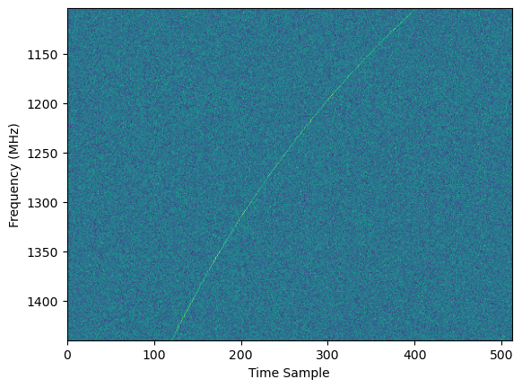
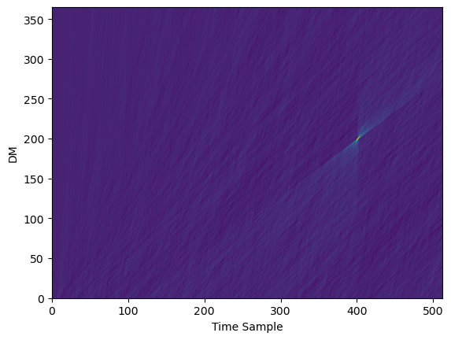
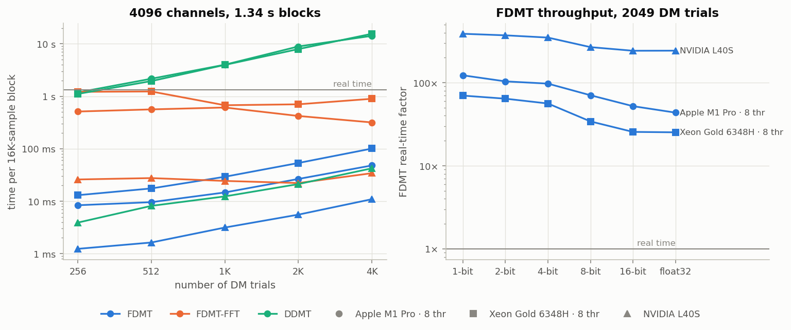

<p align="center">
  <picture>
    <source media="(prefers-color-scheme: dark)" srcset="docs/_static/logo/dmt-logo-tagline-dark.svg">
    
  </picture>
</p>

<div align="center">

[](https://dmt.readthedocs.io/en/latest/?badge=latest)
[](https://github.com/pravirkr/dmt/actions/workflows/ci.yml)
[](https://codecov.io/gh/pravirkr/dmt)
[](https://pyproject.toml)
[](include/dmt)
[](https://developer.nvidia.com/cuda-zone)
[](LICENSE)

</div>

**`dmt`** is a high-performance C++20 and Python library for radio astronomy dedispersion transforms. Engineered for real-time transient detection pipelines (FRBs, pulsars, and fast transients), it implements the complete family of dedispersion algorithms: **FDMT**, **DDMT**, **SDMT**, **CFDMT**, **FDMT-FFT** and **DDMT-FFT** (NUFFT-accelerated).

| Dispersed Waterfall Input $I(\nu, t)$ | Dedispersed DM-Time Plane $DMT(\text{DM}, t)$ |
| :---: | :---: |
|  |  |

---

## ⚡ Quickstart

### Python

```python
import numpy as np
from dmtlib import compute_fdmt
from dmtlib.simulate import generate_frb

# 1. Simulate an FRB in a 256-channel filterbank.
# generate_frb returns one float32 waterfall of shape (nchans, nsamps).
waterfall = generate_frb(
    f_min=1200.0,
    f_max=1600.0,
    nchans=256,
    nsamps=1024,
    tsamp=1e-3,
    dm=150.0,
    amp=3.0,
    offset=200,
    noise_rms=1.0,
)

# 2. Dedisperse with the Fast Dispersion Measure Transform
dmt, plan = compute_fdmt(
    waterfall,
    f_min=1200.0,
    f_max=1600.0,
    nchans=256,
    nsamps=1024,
    tsamp=1e-3,
    dt_max=180,
    mode="valid",
)

# 3. Locate the candidate in the DM-time plane
dmt_plane = dmt.reshape(plan.dmt_ndms, plan.dmt_nsamps)
peak_dm_idx, peak_time = np.unravel_index(np.argmax(dmt_plane), dmt_plane.shape)
print(
    f"Detected FRB at DM = {plan.dm_grid_final[peak_dm_idx]:.2f} pc cm^-3, sample = {peak_time}"
)
```

### C++20

```cpp
#include <iostream>
#include <vector>
#include <span>
#include <dmt/dmt.hpp>

int main() {
    dmt::algorithms::FDMT fdmt(
        /*f_min=*/1200.0f, /*f_max=*/1600.0f, /*nchans=*/256, /*nsamps=*/1024,
        /*tsamp=*/1e-3f, /*dt_max=*/128, /*dt_min=*/0, /*dt_step=*/1,
        /*use_box_smearing=*/true, /*mode=*/"valid",
        dmt::Exec::cpu(/*nthreads=*/4)  // or Exec::cuda(0), Exec::hip(0)
    );

    const auto& plan = fdmt.get_plan();
    std::vector<float> waterfall(256 * 1024, 0.0f);
    std::vector<float> dmt_out(plan.get_buffer_size(), 0.0f);

    fdmt.execute(
        std::span<const float>(waterfall.data(), waterfall.size()),
        std::span<float>(dmt_out.data(), dmt_out.size())
    );

    // Result: the first plan.get_dmt_size() floats, (ndms, dmt_nsamps)
    // row-major; the rest of the buffer is scratch.
    std::cout << "Dedispersed " << plan.get_dmt_ndms() << " DM trials!\n";
    return 0;
}
```

---

## 📦 Installation

### Python Package

From source using `uv` (recommended) or `pip`:

```bash
git clone https://github.com/pravirkr/dmt.git
cd dmt

# Install with development and documentation dependencies
pip install -e ".[develop,docs,tests]"

# Or with uv
uv sync --extra docs --extra tests
```

The GPU backend is picked up automatically (`DMT_GPU=AUTO`: CUDA, else
ROCm/HIP); to require one:

```bash
CMAKE_ARGS="-DDMT_GPU=CUDA" pip install .   # or -DDMT_GPU=HIP
```

### C++ Library (CMake)

```bash
mkdir build && cd build
cmake .. -DCMAKE_BUILD_TYPE=Release -DDMT_BUILD_TESTING=ON
cmake --build . -j
ctest --output-on-failure
sudo cmake --install .
```

Link in your project's `CMakeLists.txt`:

```cmake
find_package(dmt REQUIRED)
target_link_libraries(my_pipeline PRIVATE dmt::dmt)
```

---

## 📊 Benchmarks

Measured on an Apple M1 Pro and an Intel Xeon Gold 6348H (both 8 threads) and
an NVIDIA L40S, all with dmt 0.6.0. The data are 4096 channels (704–1216 MHz,
81.92 µs) in 16K-sample blocks (1.34 s), processed as a stream.

- **Left:** time per block for FDMT, FFT-based FDMT, brute-force DDMT,
  SDMT (exact DDMT sums with shared partial sums) and DDMT-FFT (NUFFT-accelerated) on the same DM grid. The grey line is real time.
- **Right:** how many times faster than real time FDMT runs, by input bit
  width.

<picture>
  <source media="(prefers-color-scheme: dark)" srcset="bench/results/plots/dark/readme_highlight.png">
  
</picture>

At 2049 DM trials, FDMT is 11× faster than brute-force DDMT on the Xeon
and 33× on the M1 Pro, and 3–8× faster than SDMT,
which runs 6–8× faster than real time on both CPUs. On the L40S, FDMT is 4.5×
faster than DDMT (whose DM-tiled kernels run 63–95× faster than real time) and
1.8× faster than SDMT (159–179× real time). FDMT runs 25–53× faster than real
time on 8 CPU threads and 282× on the L40S, rising to 615× with packed 1-bit
input. The Fourier-domain engines add exact fractional delays with sub-sample
precision: **FDMT-FFT** trails FDMT by only 1.2–1.4× on the Xeon and L40S
(5.5 ms on GPU), while **DDMT-FFT (NUFFT)** is 2–4.5× faster than brute-force DDMT.

All sweeps, per-machine numbers and the operation-count comparison are on the
[Benchmarks](https://dmt.readthedocs.io/en/latest/benchmarks.html) page.
[`bench/README.md`](bench/README.md) shows how to reproduce them.

---

## 📜 Citations & Algorithm References

If you use `dmt` in your research, please cite the library and the foundational FDMT paper:

```bibtex
@ARTICLE{2017ApJ...835...11Z,
       author = {{Zackay}, Barak and {Ofek}, Eran O.},
        title = "{An Accurate and Efficient Algorithm for Detection of Radio Bursts with an Unknown Dispersion Measure, for Single-dish Telescopes and Interferometers}",
      journal = {\apj},
     keywords = {methods: data analysis, methods: statistical, Astrophysics - Instrumentation and Methods for Astrophysics},
         year = 2017,
        month = jan,
       volume = {835},
       number = {1},
          eid = {11},
        pages = {11},
          doi = {10.3847/1538-4357/835/1/11},
archivePrefix = {arXiv},
       eprint = {1411.5373},
 primaryClass = {astro-ph.IM},
       adsurl = {https://ui.adsabs.harvard.edu/abs/2017ApJ...835...11Z},
      adsnote = {Provided by the SAO/NASA Astrophysics Data System}
}


@software{kumar2026dmt,
  author = {Kumar, Pravir and Zackay, Barak},
  title = {{dmt: Fast Dispersion Measure Transform Library}},
  url = {https://github.com/pravirkr/dmt},
  year = {2026}
}
```

The algorithms implemented in `dmt` build upon foundational literature and open-source frameworks:

- **FDMT, FDMT-FFT, CFDMT:** Zackay & Ofek (2017), *ApJ*, 835, 11 ([arXiv:1411.5373](https://arxiv.org/abs/1411.5373))
- **DDMT-FFT (FDD):** Bassa et al. (2022), *A&A*, 657, A46 (Fourier-domain dedispersion); NUFFT kernel: Barnett, Magland & af Klinteberg (2019), *SIAM J. Sci. Comput.*, 41, C479
- **DDMT:** Barsdell et al. (2012), *MNRAS*, 422, 379 ([doi:10.1111/j.1365-2966.2012.20622.x](https://doi.org/10.1111/j.1365-2966.2012.20622.x))
- **SDMT:** Naidu et al. (2024), AT-RASC 2024 ([doi:10.46620/ursiatrasc24/hbrq1825](http://dx.doi.org/10.46620/ursiatrasc24/hbrq1825))

## 📄 License

This project is licensed under the MIT License - see the [LICENSE](LICENSE) file for details.
