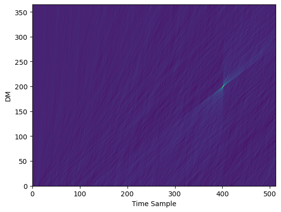

# dmt

[](https://github.com/pravirkr/dmt/actions/workflows/ci.yml)
[](https://github.com/pravirkr/dmt/blob/main/LICENSE)

## Dispersion Measure Transforms
|           |           |
| --------- | --------- |
|  |  |


## Installation

Using [pip](https://pip.pypa.io):

```bash
pip install -U git+https://github.com/pravirkr/dmt
```

## Usage

```python
from dmt.libdmt import FDMT

frb = np.ones((nchans, nsamps), dtype=np.float32)
thefdmt = FDMT(f_min, f_max, nchans, nsamps, tsamp, dt_max=dt_max, dt_min=0, dt_step=1)
dmt_transform = thefdmt.execute(frb.astype(np.float32))
```


